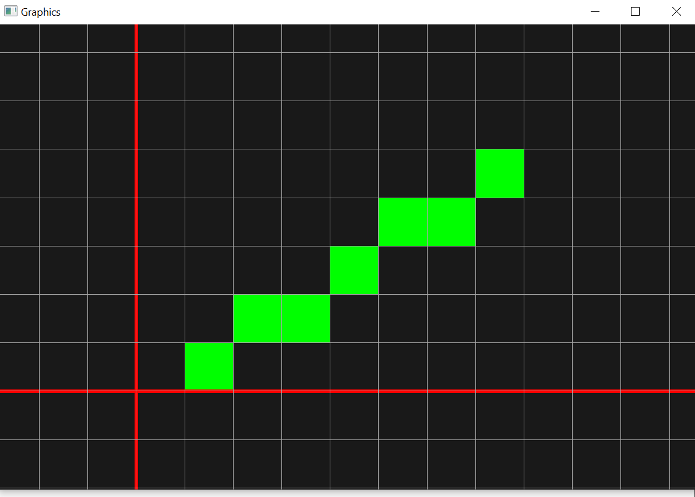

## Graphics API

A simple API that can be used to plot pixels on the screen.  
It can be used to visualize raster algorithms used in computer graphics. For example : Bressenham's line drawing algorithm, mid-point circle drawing algorithm or flood fill algorithms and anti-aliasing.  
 
It uses opengl as renderer and uses GLFW for context creation.  
 
It supports basic features like :  
Moving the grid left, right, top or down with directional arrow keys  
Zooming in and out with mouse scroll key  
Panning with left clicked and dragging  
Quiting with ESC Key :D   

A line drawn form (1,0) to (7,4) using DDA line drawing algorithm  

	

 
